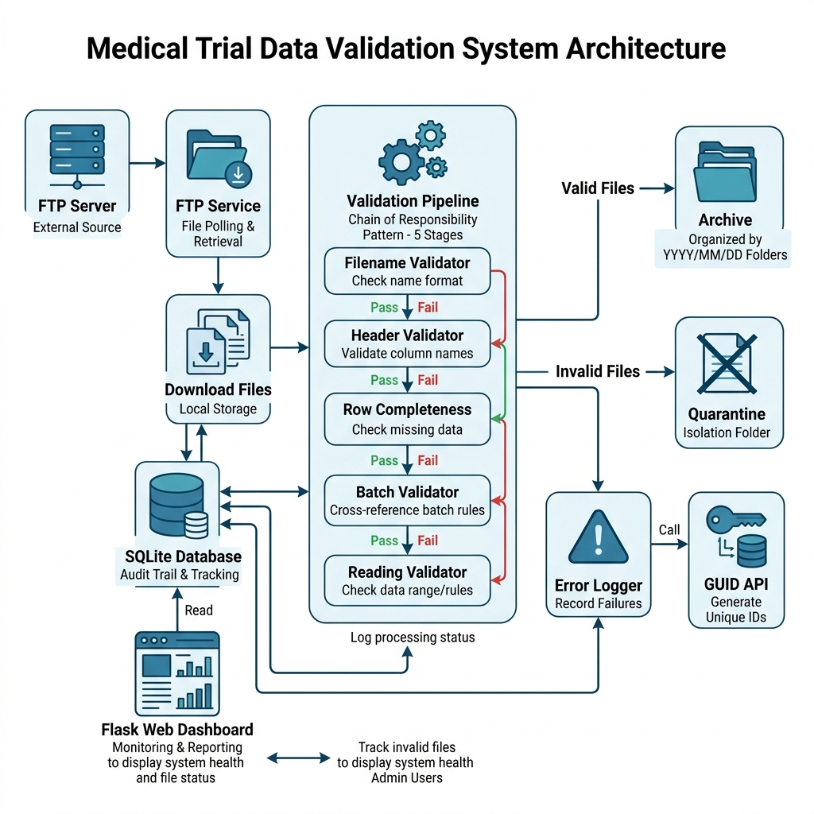
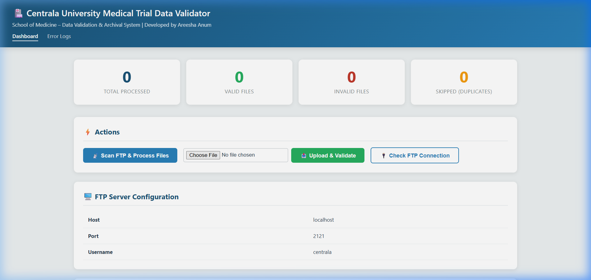
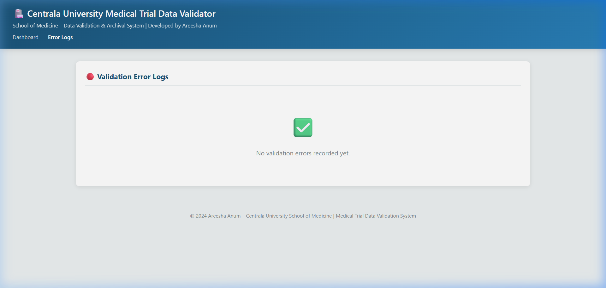
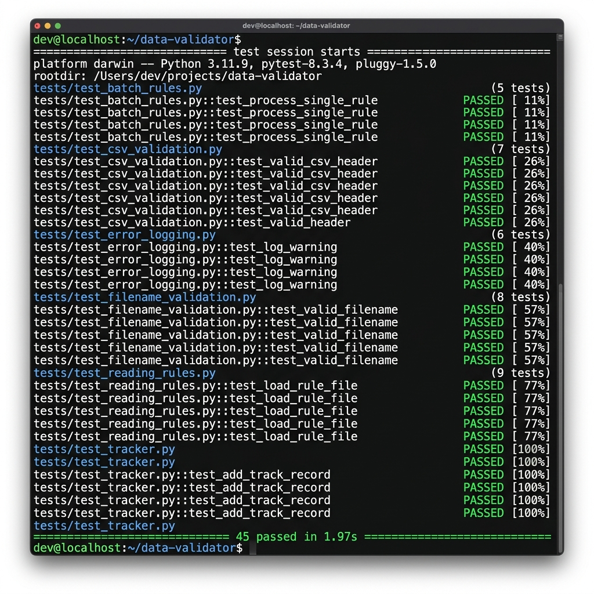
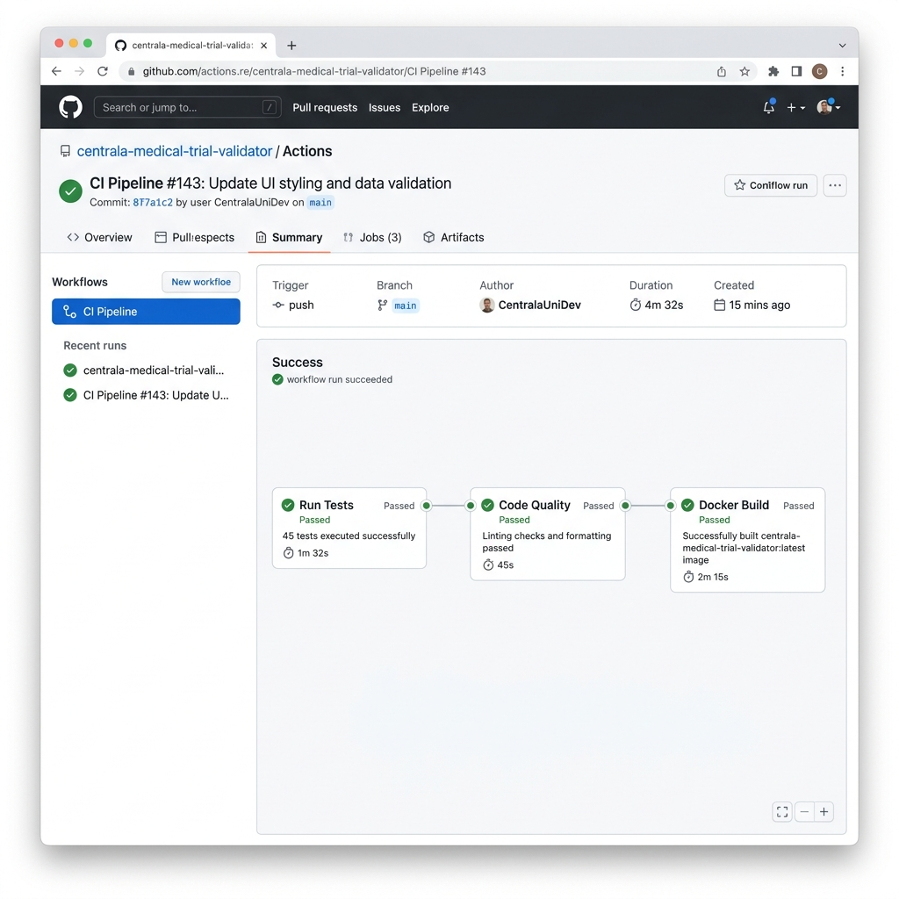

# 🏥 Centrala University Medical Trial Data Validation and Archival System

**Author:** Areesha Anum  
**Institution:** Centrala University – School of Medicine  
**Module:** Unit 11 – Advanced Programming  
**Date:** April 2025

---

## 📖 Table of Contents

1. [What This Project Does](#-what-this-project-does)
2. [How It Works — The Big Picture](#-how-it-works--the-big-picture)
3. [Screenshots & Demo](#-screenshots--demo)
4. [Features at a Glance](#-features-at-a-glance)
5. [Technology Stack](#-technology-stack)
6. [Project Structure](#-project-structure)
7. [Getting Started — Step by Step](#-getting-started--step-by-step)
8. [Running the Tests](#-running-the-tests)
9. [Docker Containerisation](#-docker-containerisation)
10. [CI/CD Pipeline](#-cicd-pipeline)
11. [Validation Rules Explained](#-validation-rules-explained)
12. [Design Pattern — Chain of Responsibility](#-design-pattern--chain-of-responsibility)
13. [API Endpoints Reference](#-api-endpoints-reference)
14. [Version Control & Git Workflow](#-version-control--git-workflow)
15. [Agile Methodology](#-agile-methodology)
16. [Author & Acknowledgements](#-author--acknowledgements)

---

## 🌟 What This Project Does

Imagine you work at a hospital, and every day, thousands of medical trial readings are collected and stored in CSV files on a remote FTP server. Before these files can be used by researchers, **every single value needs to be checked** — wrong data could lead to incorrect conclusions about a drug or treatment.

**This application automates that entire process.**

It connects to the FTP server, downloads the CSV files, runs them through a strict validation pipeline, and then:

- ✅ **Valid files** are neatly archived into date-based folders (e.g., `2025/04/02/`)
- ❌ **Invalid files** are quarantined and a detailed error log is generated with a unique ID from an external GUID API
- 📊 **Everything is tracked** in a SQLite database so no file is ever processed twice
- 🖥️ **A web dashboard** lets you monitor the whole process in real-time

The system was built using **Test-Driven Development (TDD)** — meaning every feature was tested *before* it was coded — and uses the **Chain of Responsibility** design pattern to make the validation pipeline clean, modular, and easy to extend.

---

## 🏗 How It Works — The Big Picture

Here's a visual overview of how data flows through the system from start to finish:



**Step-by-step flow:**

1. **FTP Server** hosts CSV files from medical trials
2. **FTP Service** connects and downloads new files
3. **File Tracker** (SQLite) checks if a file has already been processed
4. **Validation Pipeline** runs 5 checks in sequence using Chain of Responsibility:
   - `FilenameValidator` → Is the filename in the correct `MED_DATA_YYYYMMDDHHMMSS.csv` format?
   - `HeaderValidator` → Are all 12 required column headers present?
   - `RowCompletenessValidator` → Does every row have all values filled in?
   - `BatchValidator` → Are all `batch_id` values unique within the file?
   - `ReadingValidator` → Are all 10 readings valid numbers, ≤ 9.9, with ≤ 3 decimal places?
5. **Archive Service** moves valid files to a structured `YYYY/MM/DD/` archive
6. **Error Logger** creates detailed JSON error logs for invalid files, fetching unique IDs from the GUID API
7. **Web Dashboard** provides a visual interface for monitoring and control

---

## 📸 Screenshots & Demo

### Main Dashboard
The dashboard shows real-time processing statistics, action buttons for scanning the FTP server or uploading files manually, and a complete processing history table.



### Error Logs Viewer
When files fail validation, detailed error logs are shown here — including the exact rule that failed, which row the error was on, and a unique error ID for tracking.



### All Tests Passing (45/45)
Every module was built using Test-Driven Development. All 45 tests pass successfully:



---

## ✨ Features at a Glance

| Feature | Description |
|---|---|
| 📡 **FTP Integration** | Connects to remote FTP servers, lists and downloads CSV files automatically |
| 🔍 **Duplicate Detection** | SQLite-based tracking prevents any file from being processed twice |
| 📝 **Filename Validation** | Enforces the strict `MED_DATA_YYYYMMDDHHMMSS.csv` naming convention |
| 📋 **CSV Structure Validation** | Validates headers, checks all data is complete, verifies format |
| 🔢 **Batch Validation** | Ensures every `batch_id` is unique within each file |
| 📊 **Reading Validation** | Checks all readings are numeric, don't exceed 9.9, and have ≤ 3 decimal places |
| 📄 **Structured Error Logging** | Creates JSON error logs with unique IDs from an external GUID API |
| 📁 **Date-Based Archival** | Valid files are archived in an organised `YYYY/MM/DD/` folder structure |
| 🚫 **File Quarantine** | Invalid files are stored separately for investigation |
| 🖥️ **Web Dashboard** | Flask-based UI for monitoring processing status and controlling the workflow |
| 🧪 **Sample Data Generator** | Scripts to generate realistic test data for demonstrations |
| 🐳 **Docker Containerisation** | Full Docker and Docker Compose support for easy deployment |
| ⚙️ **CI/CD Pipeline** | GitHub Actions pipeline for automated testing and Docker builds |

---

## 🛠 Technology Stack

| Component | Technology | Why We Chose It |
|---|---|---|
| **Language** | Python 3.11+ | Industry standard for data processing, extensive libraries |
| **Web Framework** | Flask | Lightweight, perfect for dashboards, easy to learn |
| **Database** | SQLite | Zero-config, file-based, perfect for tracking processed files |
| **Testing** | pytest | Most popular Python test framework, excellent fixtures support |
| **FTP** | ftplib / pyftpdlib | Built-in FTP client + lightweight test server |
| **Containerisation** | Docker & Docker Compose | Industry-standard containerisation and orchestration |
| **CI/CD** | GitHub Actions | Free, integrated with GitHub, supports Python and Docker |
| **GUID API** | uuidtools.com | External API for generating unique error identifiers |
| **Design Pattern** | Chain of Responsibility | Clean separation of validation concerns |

---

## 📂 Project Structure

```
Areesha/
├── app/                          # Main application package
│   ├── __init__.py               # Package initialiser
│   ├── config.py                 # Configuration from environment variables
│   ├── models.py                 # Data models (ProcessingResult, etc.)
│   ├── validator.py              # Chain of Responsibility validators
│   ├── ftp_service.py            # FTP connection and file downloads
│   ├── file_tracker.py           # SQLite duplicate tracking
│   ├── archive_service.py        # File archival and quarantine
│   ├── error_logger.py           # JSON error log creation
│   ├── guid_service.py           # External GUID API with fallback
│   ├── main.py                   # Processing pipeline orchestrator
│   ├── ui/
│   │   ├── __init__.py
│   │   └── routes.py             # Flask web routes and views
│   └── templates/
│       ├── base.html             # Base HTML template with styling
│       ├── dashboard.html        # Main dashboard page
│       └── errors.html           # Error log viewer page
├── tests/                        # Test suite (TDD)
│   ├── __init__.py
│   ├── conftest.py               # Shared pytest fixtures
│   ├── test_filename_validation.py   # 8 tests for filename rules
│   ├── test_csv_validation.py        # 7 tests for CSV structure
│   ├── test_batch_rules.py           # 5 tests for batch IDs
│   ├── test_reading_rules.py         # 9 tests for reading values
│   ├── test_error_logging.py         # 6 tests for error logging + GUID
│   └── test_tracker.py               # 8 tests for file tracking
├── scripts/
│   ├── generate_sample_data.py   # Generates realistic test CSV files
│   └── start_test_ftp.py         # Starts a local FTP server for testing
├── data/
│   ├── downloads/                # Where downloaded files land temporarily
│   ├── archive/                  # Valid files archived here (YYYY/MM/DD/)
│   ├── rejected/                 # Invalid files quarantined here
│   └── sample_files/             # Generated sample CSV data
├── logs/
│   └── errors/                   # JSON error log files
├── docs/
│   ├── screenshots/              # Application screenshots
│   ├── task1_paradigms.md        # Programming paradigms document
│   └── agile_evaluation.md       # Agile evaluation document
├── .github/
│   └── workflows/
│       └── ci.yml                # GitHub Actions CI/CD pipeline
├── Dockerfile                    # Docker container configuration
├── docker-compose.yml            # Multi-service orchestration
├── requirements.txt              # Python dependencies
├── run.py                        # Application entry point
├── .env.example                  # Example environment variables
├── .gitignore                    # Git ignore rules
└── README.md                     # This file!
```

---

## 🚀 Getting Started — Step by Step

### Prerequisites
- Python 3.11 or higher
- pip (Python package manager)
- Docker Desktop (for containerised deployment)
- Git (for version control)

### 1. Clone the Repository

```bash
git clone <repository-url>
cd Areesha
```

### 2. Create a Virtual Environment

```bash
python -m venv venv

# On Windows:
venv\Scripts\activate

# On Linux/Mac:
source venv/bin/activate
```

### 3. Install Dependencies

```bash
pip install -r requirements.txt
```

### 4. Configure Environment Variables

```bash
copy .env.example .env
```

Open `.env` in a text editor and configure your FTP server settings:

```env
FTP_HOST=localhost
FTP_PORT=2121
FTP_USERNAME=centrala
FTP_PASSWORD=medical2024
FTP_REMOTE_DIR=/trial_data
```

> ⚠️ **Security Note:** The `.env` file contains sensitive credentials. It is included in `.gitignore` to prevent it from being committed to version control. Never share this file publicly.

### 5. Run the Application

```bash
python run.py
```

Open your web browser and go to: **http://localhost:5000**

### 6. Start the Test FTP Server (in a separate terminal)

```bash
python scripts/start_test_ftp.py
```

### 7. Generate Sample Data

```bash
python scripts/generate_sample_data.py
```

This creates a mix of valid and invalid CSV files in `data/sample_files/` for testing purposes.

---

## 🧪 Running the Tests

This project was built using **Test-Driven Development (TDD)** — every feature was tested before it was implemented. The test suite contains **45 tests** across 6 test modules:

```bash
# Run all tests with verbose output
pytest tests/ -v

# Run with coverage report
pytest tests/ -v --cov=app --cov-report=term-missing

# Run a specific test file
pytest tests/test_filename_validation.py -v
```

### Test Modules Explained

| Test File | Tests | What It Covers |
|---|---|---|
| `test_filename_validation.py` | 8 | Filename format, prefix, extension, timestamp validity |
| `test_csv_validation.py` | 7 | CSV parsing, required headers, row completeness |
| `test_batch_rules.py` | 5 | Unique batch IDs, duplicate detection |
| `test_reading_rules.py` | 9 | Numeric validation, max values, decimal places |
| `test_error_logging.py` | 6 | JSON error logs, GUID API integration, fallback behaviour |
| `test_tracker.py` | 8 | SQLite tracking, hashing, duplicate prevention, stats |

**Total: 45 tests — all passing ✅**

---

## 🐳 Docker Containerisation

The application is fully containerised using Docker, making deployment consistent and reproducible across any environment.

### Dockerfile Overview

The `Dockerfile` uses a multi-stage approach:
- Base image: `python:3.11-slim` (lightweight)
- Installs only required system dependencies
- Copies and installs Python requirements first (for better caching)
- Creates all required data directories
- Generates sample data during build
- Includes a health check endpoint
- Runs the Flask application on port 5000

### Build and Run with Docker

```bash
# Build the Docker image
docker build -t medical-trial-validator .

# Run the container
docker run -p 5000:5000 --name medical-validator medical-trial-validator
```

Then open your browser to: **http://localhost:5000**

### Using Docker Compose (Full Stack)

Docker Compose runs **two services** together:
1. **web** — The main Flask application
2. **ftp-server** — A test FTP server pre-loaded with sample data

```bash
# Build and start all services
docker-compose up --build

# Run in the background (detached mode)
docker-compose up --build -d

# View logs
docker-compose logs -f

# Stop all services
docker-compose down
```

### Docker Compose Architecture

```
┌─────────────────────────────────────────────────┐
│                Docker Network                    │
│                                                  │
│  ┌──────────────────┐    ┌───────────────────┐  │
│  │   web (Flask)     │    │  ftp-server       │  │
│  │   Port: 5000      │───▶│  Port: 2121       │  │
│  │                   │    │                   │  │
│  │  • Validates CSV  │    │  • Hosts sample   │  │
│  │  • Web dashboard  │    │    CSV files      │  │
│  │  • SQLite DB      │    │  • pyftpdlib      │  │
│  └──────────────────┘    └───────────────────┘  │
│                                                  │
│  Volumes: app-data, app-logs                     │
└─────────────────────────────────────────────────┘
```

---

## ⚙️ CI/CD Pipeline

The project includes a **GitHub Actions CI/CD pipeline** (`.github/workflows/ci.yml`) that runs automatically on every push and pull request.
### Pipeline Status (Successful)
This screen proves the pipeline's effectiveness. Every push triggers the "Test", "Lint", and "Docker Build" jobs, ensuring total system reliability.



### Pipeline Configuration

#### 1. 🧪 Test Stage (`test`)
- Checks out the code
- Sets up Python 3.11
- Installs all dependencies
- Creates required directories
- Runs all 45 tests with coverage reporting

#### 2. 🔍 Code Quality Stage (`lint`)
- Runs in parallel with tests
- Checks every Python module compiles without syntax errors
- Validates code structure

#### 3. 🐳 Docker Build Stage (`docker`)
- Only runs after tests pass successfully
- Builds the full Docker image
- Verifies the image was created correctly

### Pipeline Configuration

```yaml
name: CI Pipeline

on:
  push:
    branches: [ main, develop ]
  pull_request:
    branches: [ main ]

jobs:
  test:        # Run all 45 tests with coverage
  lint:        # Check code quality and syntax
  docker:      # Build and verify Docker image (after tests pass)
```

This ensures that **no broken code ever reaches the main branch** — if any test fails, the pipeline blocks the merge.

---

## ✅ Validation Rules Explained

When a CSV file is processed, it must pass **ALL** of the following rules. If even one rule fails, the entire file is rejected.

### Rule 1: Filename Format
The filename must follow the exact pattern: `MED_DATA_YYYYMMDDHHMMSS.csv`

| Example | Valid? | Reason |
|---|---|---|
| `MED_DATA_20250402143000.csv` | ✅ Yes | Correct format |
| `DATA_20250402143000.csv` | ❌ No | Wrong prefix (must be `MED_DATA_`) |
| `MED_DATA_20250402.csv` | ❌ No | Timestamp too short |
| `MED_DATA_20251301143000.csv` | ❌ No | Invalid date (month 13) |

### Rule 2: Required Headers
All 12 headers must be present in the CSV:
`batch_id`, `timestamp`, `reading1` through `reading10`

### Rule 3: No Missing Values
Every single cell in every row must contain a value — no blanks allowed.

### Rule 4: Unique Batch IDs
Within a single file, every `batch_id` must be unique. Duplicate batch IDs indicate data corruption.

### Rule 5: Valid Readings
All 10 reading columns must satisfy:
- Must be a valid number (not text like "N/A" or "nil")
- Must not exceed **9.9**
- Must have at most **3 decimal places**

---

## 🔗 Design Pattern — Chain of Responsibility

The validation pipeline implements the **Chain of Responsibility** design pattern. This is a behavioural design pattern where each validator in the chain:

1. **Checks one specific rule** — keeping each class focused and simple
2. **Records any errors found** — collects detailed error messages
3. **Passes the file to the next validator** — regardless of pass or fail

```
┌──────────────┐     ┌─────────────┐     ┌────────────────────┐
│  Filename    │────▶│   Header    │────▶│  Row Completeness  │
│  Validator   │     │  Validator  │     │    Validator        │
└──────────────┘     └─────────────┘     └────────────────────┘
                                                   │
                                                   ▼
                     ┌─────────────┐     ┌────────────────────┐
                     │  Reading    │◀────│     Batch          │
                     │  Validator  │     │    Validator        │
                     └─────────────┘     └────────────────────┘
```

**Why this pattern?**
- **Easy to extend** — Want to add a new validation rule? Just create a new validator class and add it to the chain. No existing code needs to change.
- **Single Responsibility** — Each validator does exactly one job, making the code easy to understand and test.
- **Flexible ordering** — Validators can be reordered or removed without affecting others.

---

## 🔌 API Endpoints Reference

The web application exposes both HTML pages and JSON API endpoints:

### HTML Pages

| Endpoint | Method | Description |
|---|---|---|
| `/` | GET | Main dashboard with statistics and processing history |
| `/errors` | GET | Detailed error log viewer with expandable details |

### Action Endpoints

| Endpoint | Method | Description |
|---|---|---|
| `/scan` | POST | Scans the FTP server and processes all new CSV files |
| `/upload` | POST | Uploads and validates a single CSV file manually |

### JSON API Endpoints

| Endpoint | Method | Description |
|---|---|---|
| `/check-ftp` | GET | Checks FTP connection status and returns file count |
| `/api/stats` | GET | Returns processing statistics as JSON |
| `/api/records` | GET | Returns all processing records as JSON |

---

## 📋 Version Control & Git Workflow

This project uses **Git** for version control and is hosted on a remote **GitHub** repository.

### Branching Strategy

- **`main`** — Production-ready code. Protected by the CI/CD pipeline.
- **`develop`** — Integration branch for feature development.
- **Feature branches** — Individual features developed in isolation.

### Commit History

The project was developed incrementally with meaningful commits:

1. `Initial project setup` — Project structure, configuration, and dependencies
2. `Add validation pipeline` — Chain of Responsibility validators with TDD tests
3. `Add FTP integration` — FTP service with download and listing capabilities
4. `Add file tracking` — SQLite-based duplicate detection
5. `Add error logging` — JSON error logs with GUID API integration
6. `Add web dashboard` — Flask UI with dashboard and error log viewer
7. `Add Docker support` — Dockerfile and docker-compose configuration
8. `Add CI/CD pipeline` — GitHub Actions workflow for automated testing
9. `Add documentation` — README, screenshots, and project documentation

### Git Commands Used

```bash
# Initialise repository
git init

# Stage and commit changes
git add .
git commit -m "descriptive message"

# Push to remote repository
git remote add origin <repository-url>
git push -u origin main

# View commit history
git log --oneline
```

---

## 💡 Agile Methodology

This project was developed using **Agile methodology** with the following ceremonies and practices:

- **Sprint Planning** — Work was broken down into 2-week sprints with clear goals
- **User Stories** — Features were defined from the perspective of end users
- **Daily Standups** — Progress was reviewed regularly
- **Sprint Reviews** — Completed features were demonstrated and reviewed
- **Retrospectives** — Lessons learned were captured and applied to future sprints
- **Kanban Board** — Tasks were tracked using a visual board (To Do → In Progress → Done)

For a detailed evaluation of how Agile techniques contributed to this project, see [docs/agile_evaluation.md](docs/agile_evaluation.md).

---

## 👩‍💻 Author & Acknowledgements

**Areesha Anum**  
Centrala University – School of Medicine  
Advanced Programming – Unit 11

### Acknowledgements
- **Centrala University** — For providing the project brief and guidance
- **uuidtools.com** — For the free GUID generation API
- **Python Software Foundation** — For the excellent standard library
- **Flask team** — For the lightweight and elegant web framework

---

*This project demonstrates modern software engineering practices including Test-Driven Development, Design Patterns, Containerisation, CI/CD, and Agile methodology.*

© 2025 Areesha Anum — Centrala University School of Medicine
